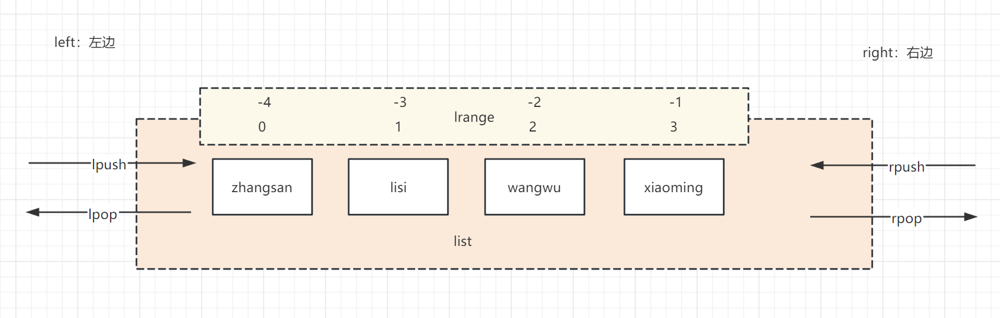

### Redis 基本操作

- [Redis 基本操作](#redis-基本操作)
  - [一、连接 Redis 服务器](#一连接-redis-服务器)
  - [二、Redis 命令行基础](#二redis-命令行基础)

#### 一、连接 Redis 服务器

**使用 Redis 命令行工具（redis-cli）：**

```bash
# 连接到本地 Redis 服务器，默认端口为 6379
redis-cli

# 连接到远程 Redis 服务器
redis-cli -h your_redis_host -p your_redis_port -a your_redis_password
```

**在 Go 中使用 go-redis/redis:**

在 Go 语言中，可以使用官方推荐的 Redis 客户端库 `go-redis/redis` 来连接 Redis 服务器。以下是如何安装并连接到 Redis 服务器的示例：

首先，通过 `go get` 命令安装 `go-redis/redis` 库：

```bash
go get -u github.com/go-redis/redis/v8
```

然后，在你的 Go 程序中导入并使用该库连接 Redis：

```go
package main

import (
	"context"
	"fmt"
	"github.com/go-redis/redis/v8"
)

func main() {
	// 创建一个 Redis 客户端实例
	rdb := redis.NewClient(&redis.Options{
		Addr:     "localhost:6379", // 本地 Redis 的地址和端口
		Password: "",               // 如果有密码则填写
		DB:       0,                // 数据库索引号，默认是0
	})

	// 测试连接是否成功
	ctx := context.Background()
 pong, err := rdb.Ping(ctx).Result()
	if err != nil {
		panic(err)
	}
	fmt.Println(pong) // 输出：PONG

	// 使用完后关闭连接（通常在一个长生命周期的服务里，客户端会一直保持打开状态）
	defer rdb.Close()
}
```

若要连接远程 Redis 服务器，请将 `Addr` 字段替换为远程服务器的地址和端口：

```go
rdb := redis.NewClient(&redis.Options{
    Addr:     "your_redis_host:your_redis_port",
    Password: "your_password", // 如果有密码则填写
    DB:       0,
})
```

请确保根据实际情况更改主机名、端口号和密码等信息。

#### 二、Redis 命令行基础

Redis 命令行工具（redis-cli）是 Redis 提供的用于与 Redis 服务器交互的客户端工具。以下是 Redis 命令行的基础操作示例：

1. **连接 Redis 服务器：**
   ```bash
   redis-cli
   ```
   默认情况下，它会尝试连接本地主机上的 Redis 服务（端口为6379）。如果需要连接远程服务器或指定端口，可以这样使用：
   ```bash
   redis-cli -h your_host -p your_port
   ```

2. **键值操作：**
   - 设置键值对：
     ```bash
     SET key value
     ```
     示例：
     ```bash
     SET myKey "Hello, Redis!"
     ```
   - 获取键值：
     ```bash
     GET key
     ```
     示例：
     ```bash
     GET myKey
     ```
   - 删除键：
     ```bash
     DEL key
     ```
     示例：
     ```bash
     DEL myKey
     ```
   - 判断键值是否存在：
     ```bash
     exists key
     ```
     示例：
     ```bash
     exists myKey    # 1 true  0 false
     ```
   - 获取键值，获取不到就设置键值对，获取到重新赋值：
     ```bash
     GETSET key value
     ```
     示例：
     ```bash
     GETSET myKey redis 
     ```
   - 批量设置键值对：
     ```bash
     mset key1 value1 key2 value2
     ```
     示例：
     ```bash
     mset name1 hello name2 redis
     ```
   - 计数：
     ```bash
     incr key         # 自增1
     decr key         # 自减1
     incrby key num   # 自增num
     decrby key num   # 自增num
     ```
     示例：
     ```bash
     get n            # nil
     incr n           # 1
     incr n           # 2
     decr n           # 1
     incrby 10        # 11
     incrby 11        # 0
     ```
   - 过期、有效期：
     ```bash
     setex key time value       # 设置过期 单位是秒
     ttl key                    # 查看还有多久过期
     # 如果不设置过期时间，ttl显示的结果是-1表示永不过期
     expire key time            # 设置过期 单位是秒
     ```
     示例：
     ```bash
     setex name 20 redis
     ttl name            # 10
     ttl name            # -2 过期
     expire name1 10
     ```

3. **数据结构操作示例：**
   - 列表（List）：
     
     ```bash
     # 在列表头部插入 lpush
     LPUSH key value [value ...]

     # 在列表尾部插入 rpush
     RPUSH key value [value ...]

     # 获取并移除列表头部元素 lpop
     LPOP key

     # 获取但不移除列表头部元素 lindex
     LINDEX key index

     # 获取并移除列表尾部元素 rpop
     RPOP key

     # 获取列表长度 llen
     LLEN key

     # 获取列表指定范围内的元素 lrange
     LRANGE key start stop 

     # 将一个或多个值插入到已存在的列表中的某个位置之前或之后 linsert (BEFORE|AFTER 之前或之后; pivot: 元素中的某个元素； value： 插入元素)
     LINSERT key BEFORE|AFTER pivot value

     # 删除与给定模式匹配的所有元素 lrem
     # count > 0 : 从表头开始向表尾搜索，移除与 VALUE 相等的元素，数量为 COUNT 。
     # count < 0 : 从表尾开始向表头搜索，移除与 VALUE 相等的元素，数量为 COUNT 的绝对值。
     # count = 0 : 移除表中所有与 VALUE 相等的值。
     LREM key count value
     ```
   - 集合（Set）：是一种无序且不重复元素的集合数据结构
      ```bash
      # 添加元素到集合 sadd
      SADD key member [member ...]

      # 获取集合中的所有成员 smembers
      SMEMBERS key

      # 判断成员是否存在于集合中 sismember
      SISMEMBER key member

      # 删除集合中的一个或多个成员 srem
      SREM key member [member ...]

      # 集合间运算 sunion sinter sdiff
      SUNION key [key ...] # 并集：将多个集合合并为一个新的集合，不存在重复元素。
      SINTER key [key ...] # 交集：返回给定所有集合之间的交集。
      SDIFF key [key ...]  # 差集：返回第一个集合与其他集合之间的差集。

      # 集合大小 scard
      SCARD key

      # 随机返回集合中的几个成员 srandmember （count 随机几个）
      SRANDMEMBER key [count]

      # 移动集合中的成员到另一个集合 smove (将 member 元素从 source 集合移动到 destination 集合)
      SMOVE source destination member
      ```
   - 哈希（Hash）：
      ```bash
      # 将哈希表 key 中的字段 field 的值设为 value 。（hset）
      HSET key field value

      # 获取哈希中的所有字段和值（hgetall）
      HGETALL key

      # 获取哈希中指定字段的值（hget）
      HGET key field

      # 判断哈希中是否存在某个字段（hexists）
      HEXISTS key field

      # 删除哈希中的一个或多个字段（hdel）
      HDEL key field [field ...]

      # 获取哈希包含的字段数量（hlen）
      HLEN key

      # 批量设置哈希中的多个字段值（hmset）
      HMSET key field value [field value ...]

      # 批量获取哈希中多个字段的值（hmget）
      HMGET key field [field ...]
      ```
   - 有序集合（Sorted Set）：
     - 添加成员并附带分数：
       ```bash
       ZADD zsetKey score member
       ```
     - 按分数排序获取集合中的所有成员：
       ```bash
       ZRANGE zsetKey 0 -1 WITHSCORES
       ```

4. **其他常用命令：**
   - 查看所有键：
     ```bash
     KEYS *
     ```
   - 清空整个数据库：
     ```bash
     FLUSHDB
     ```
   - 关闭当前连接：
     ```bash
     QUIT
     ```
5. **问题处理：**
   - 中文乱码问题：
     ```bash
     redis-cli --raw
     127.0.0.1:6379> set name ﾷ￣ﾷ￣
     OK
     127.0.0.1:6379> get name
     枫枫
     # 但是输入中文仍然是乱码，无解
     ```

以上只是 Redis 命令行基础操作的一部分，Redis 支持更多丰富的命令，请参考官方文档以获取完整信息。